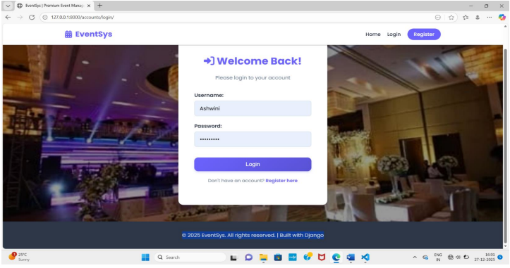
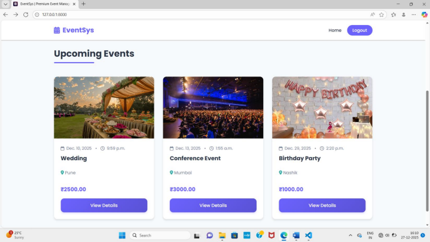
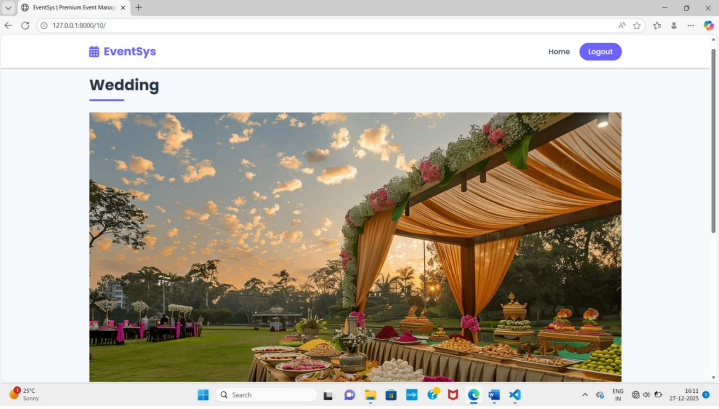
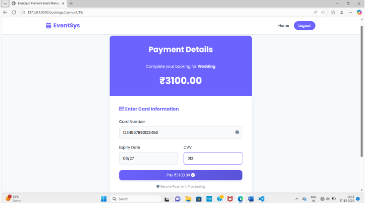
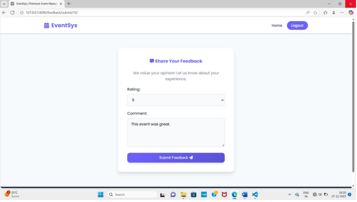
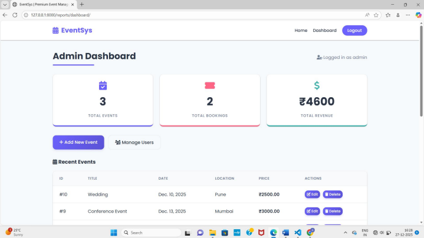

# EventSys – Event Management System

A Django-based web application for planning, organizing, and managing events online. It provides a centralized platform where **admins/organizers** can create and manage events, food items, and bookings, while **customers** can register, browse events, book tickets, select food add-ons, make payments, and leave feedback.

## ✨ Features

- **User Authentication** – Registration, login, and logout for customers
- **Event Management** – Create, update, delete, and browse events (weddings, conferences, birthday parties, etc.)
- **Booking System** – Book events, select food items, and confirm reservations
- **Payment Module** – Simulated online payment flow (advance / full payment)
- **Feedback Module** – Customers can rate and leave comments after an event
- **Admin Dashboard** – View total events, bookings, and revenue; manage events, food items, and bookings from one place
- **Media Handling** – Upload and display event images

---

## 🛠️ Tech Stack

| Layer | Technology |
|---|---|
| Backend | Python, Django |
| Frontend | HTML, CSS |
| Database | SQLite |
| Image Handling | Pillow |

---

## 📂 Project Structure

```
event/
├── accounts/        # User registration, login, logout
├── bookings/         # Event booking, food selection, payment
├── event_images/     # Uploaded event image assets
├── event_system/     # Project settings, URLs, WSGI/ASGI config
├── events/            # Event & food item models, views, templates
├── feedback/         # Customer feedback module
├── reports/           # Admin dashboard & reporting
├── templates/         # Shared/base templates
├── screenshots/        # README screenshots
├── manage.py
└── requirements.txt
```

---

## ⚙️ Setup & Installation

### 1. Clone the repository
```bash
git clone https://github.com/Kadam-Ashwini/Event-Management-Platform.git
cd Event-Management-Platform
```

### 2. Create and activate a virtual environment
```bash
python -m venv venv
venv\Scripts\activate      # Windows
source venv/bin/activate   # macOS/Linux
```

### 3. Install dependencies
```bash
pip install -r requirements.txt
```

### 4. Apply migrations
```bash
python manage.py migrate
```

### 5. Create an admin (superuser) account
```bash
python manage.py createsuperuser
```

### 6. Run the development server
```bash
python manage.py runserver
```

Visit the app at **http://127.0.0.1:8000/**

- User login/register: `http://127.0.0.1:8000/accounts/login/`
- Admin dashboard: `http://127.0.0.1:8000/reports/dashboard/`
- Django admin panel: `http://127.0.0.1:8000/admin/`

---

## 🗄️ Database Design (Overview)

| Table | Key Fields |
|---|---|
| Login | Login_id, username, password |
| Admin | Admin_id, name, password |
| Customer | Customer_id, name, password |
| Booking | Booking_ID, Event_Name, Booking_Date, Booking_Status |
| Food | Food_ID, Food_Name, Food_Type, Price |
| Payment | Payment_ID, Payment_Date, Payment_Amount, Payment_Method |
| Feedback | Feedback_ID, Customer_ID, Rating, Comments, Feedback_Date |


## 👥 User Roles

- **Customer** – Register/login, browse events, book events, select food, make payment, submit feedback
- **Admin** – Manage events, food items, bookings; view dashboard analytics (total events, bookings, revenue)

---

## 📸 Screenshots

### User Login


### Upcoming Events


### Booking an Event


### Payment Process


### Feedback Form


### Admin Dashboard


---

## 🚧 Limitations

- Limited scalability for a large number of concurrent users/events
- No advanced features like automated reminders or real-time notifications
- Depends on a stable internet connection
- No integration with third-party payment gateways (payment flow is simulated)

---

## 🔮 Future Enhancements

- AI-driven event recommendations and predictive analytics
- Real-time notifications and reminders
- Integration with real payment gateways
- Support for hybrid/virtual events with live streaming
- Enhanced analytics and reporting for organizers

---

## 👤 Author

**Kadam Ashwini**
